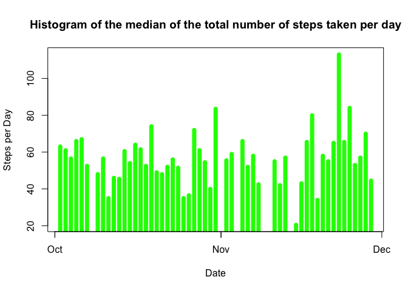

<<<<<<< HEAD
Loading and preprocessing the data
==================================

We load necessary libraries and download the data set, unzip it and
reading it using read.csv command

    library(dplyr)

    ## 
    ## Attaching package: 'dplyr'

    ## The following objects are masked from 'package:stats':
    ## 
    ##     filter, lag

    ## The following objects are masked from 'package:base':
    ## 
    ##     intersect, setdiff, setequal, union

    library(lubridate)
    library(knitr)
    library(ggplot2)

    if(!file.exists("activity.csv")){
      temp<-tempfile()
      url<-"https://d396qusza40orc.cloudfront.net/repdata%2Fdata%2Factivity.zip"
      download.file(url, temp)
      unzip(temp)
      unlink(temp)}

    df<- read.csv("./activity.csv",stringsAsFactors = FALSE)

Converting the df into dplyr table data frame

    df<- tbl_df(df)

converting df$date into lubridate date format: year, month, day

    df$date <- ymd(df$date)

grouping by date

    df_by_date<- group_by(df, date)

What is mean total number of steps taken per day?
=================================================

Summarising by mean value of steps per day

    df_by_date_mean<- summarise(df_by_date, mean(steps))

Calculate the total number of steps taken per day

    df_by_date_total <- summarise(df_by_date, total =sum(steps))

If you do not understand the difference between a histogram and a
barplot, research the difference between them. Make a histogram of the
total number of steps taken each day

    plot(df_by_date_total$date, df_by_date_total$total, type="h", main="Histogram of Daily Steps",xlab="Date", ylab="Steps per Day", col="black", lwd=7)

<!-- -->

Calculate and report the mean and median of the total number of steps
taken per day

mean

    df_by_date_mean<- summarise(df_by_date, mean(steps))
    plot(df_by_date_mean$date, df_by_date_mean$mean, type="h", main="Histogram of the mean of the total number of steps taken per day",xlab="Date", ylab="Steps per Day", col="green", lwd=7)

<!-- -->

    h<- mean(df_by_date_total$total)
    cat("Mean of Total number of steps taken per day =", h)

    ## Mean of Total number of steps taken per day = NA

median

    df_by_date_median<- df_by_date%>%filter(steps != 0)%>%summarise(median(steps))

    plot(df_by_date_median$date, df_by_date_median$median, type="h", main="Histogram of the median of the total number of steps taken per day",xlab="Date", ylab="Steps per Day", col="green", lwd=7)

<!-- -->

    m=median(df_by_date_total$total)
    cat("Median of Total number of steps taken per day =", m)

    ## Median of Total number of steps taken per day = NA

What is the average daily activity pattern?
===========================================

Make a time series plot (i.e. type = "l") of the 5-minute interval
(x-axis) and the average number of steps taken, averaged across all days
(y-axis)

    df_no_na <- df[complete.cases(df), ]

    steps_av <- aggregate(df_no_na$steps, list(as.numeric(df_no_na$interval)), FUN="mean")

    steps_av <- rename(steps_av, interval=Group.1, mean=x)

    plot(steps_av, type="l", xlab="Interval", ylab="Number of Steps", main="Daily Activity Pattern", col=2)

<!-- -->

Which 5-minute interval, on average across all the days in the dataset,
contains the maximum number of steps?

    filter(steps_av, mean==max(mean))

    ##   interval     mean
    ## 1      835 206.1698

Calculate and report the total number of missing values in the dataset
(i.e. the total number of rows with NAs)

    total_na <- sum(is.na(df))

    cat("Total number of missing values in the dataset=", total_na)

    ## Total number of missing values in the dataset= 2304

Imputing missing values
=======================

Devise a strategy for filling in all of the missing values in the
dataset. The strategy does not need to be sophisticated. For example,
you could use the mean/median for that day, or the mean for that
5-minute interval, etc. Create a new dataset that is equal to the
original dataset but with the missing data filled in.

the strategy is to relace NAs with the median for 5 min interval where
there NAs are located. the converted data set will be storen in
df\_no\_NA data frame.

    df_no_Na <- df
    df_no_Na$steps[is.na(df_no_Na$steps)] <- with(df_no_Na, ave(steps, interval, FUN = function(x) median(x, na.rm = TRUE)))[is.na(df_no_Na$steps)]

    sum(is.na(df_no_Na))

    ## [1] 0

Make a histogram of the total number of steps taken each day and
Calculate and report the mean and median total number of steps taken per
day. Do these values differ from the estimates from the first part of
the assignment? What is the impact of imputing missing data on the
estimates of the total daily number of steps?

    df_no_Na_by_day <- group_by(df_no_Na, date)

    df_no_Na_by_day_total <- summarise(df_no_Na_by_day, total=sum(steps))

    old.par <- par(mfrow=c(1, 2))
    plot(df_no_Na_by_day_total$date, df_no_Na_by_day_total$total, type="h", main="Histogram of Daily Steps with Nas replaced with interval median",xlab="Date", ylab="Steps per Day", col="green", lwd=7)
    plot(df_by_date_total$date, df_by_date_total$total, type="h", main="Histogram of Daily Steps with NA values",xlab="Date", ylab="Steps per Day", col="steelblue", lwd=7)

<!-- -->

    par(old.par)

mean

    b=mean(df_no_Na_by_day_total$total)
    cat("Mean of Total number of steps taken per day with NAs replaced =", b)

    ## Mean of Total number of steps taken per day with NAs replaced = 9503.869

median

    n=median(df_no_Na_by_day_total$total)
    cat("Median of Total number of steps taken per day =", n)

    ## Median of Total number of steps taken per day = 10395

Visual inspection of the plots doesn't revel any drastic difference
between the data set with NA valuse and and without. We see ~12% drop in
the total mean value for the data set with Na replaced where the change
in median values are nearly neglegible

Are there differences in activity patterns between weekdays and weekends?
=========================================================================

Create a new factor variable in the dataset with two levels – “weekday”
and “weekend” indicating whether a given date is a weekday or weekend
day

    wDays <- c("Monday", "Tuesday", "Wednesday", "Thursday", "Friday")

      
    df_no_Na$wDays <- factor((weekdays(df_no_Na$date) %in% wDays), 
                      levels=c(FALSE, TRUE), labels=c('weekend', 'weekday'))

Make a panel plot containing a time series plot (i.e. type = "l") of the
5-minute interval (x-axis) and the average number of steps taken,
averaged across all weekday days or weekend days (y-axis).

Subsetting the df\_no\_NA into two data sets based on wDays value

    weekend <- subset(df_no_Na, wDays == 'weekend')
    weekday<- subset(df_no_Na, wDays == 'weekday')

aggregating and calculating the mean of steps

    steps_avg_weekend<-aggregate(weekend$steps, 
                    by = list(weekend$interval), 
                    FUN = mean, na.rm = TRUE)

    steps_avg_weekday<-aggregate(weekday$steps, 
                    by = list(weekday$interval), 
                    FUN = mean, na.rm = TRUE)

adding day\_type category and combining two data sets with mean values
for weekends and weekdays

    steps_avg_weekend$day_type <- factor('weekend')

    steps_avg_weekday$day_type <- factor('weekday')

    combined_weekend_weekday <- rbind(steps_avg_weekend, steps_avg_weekday)

    names(combined_weekend_weekday)<- c('interval', 'mean_steps', 'day_type')

Makeing a panel plot

    t <- ggplot(combined_weekend_weekday, aes(interval, mean_steps))
    t + geom_line(color="blue") + facet_grid(day_type~.)

<!-- -->
=======
We load necessary libraries an download the data set, unzip it and reading it using read.csv #command

library(dplyr)
library(lubridate)
library(knitr)
library(ggplot2)

df<- read.csv("./activity.csv",stringsAsFactors = FALSE)

Converting the df into dplyr table data frame

df<- tbl_df(df)

converting df$date into lubridate date format: year, month, day

df$date <- ymd(df$date)

grouping by date

df_by_date<- group_by(df, date)

Summarising by mean value of steps per day

df_by_date_mean<- summarise(df_by_date, mean(steps))

Calculate the total number of steps taken per day

df_by_date_total <- summarise(df_by_date, total =sum(steps))

If you do not understand the difference between a histogram and a barplot, research the difference between them. Make a histogram of the total number of steps taken each day

plot(df_by_date_total$date, df_by_date_total$total, type="h", main="Histogram of Daily Steps",xlab="Date", ylab="Steps per Day", col="black", lwd=7)

Calculate and report the mean and median of the total number of steps taken per day

mean

df_by_date_mean<- summarise(df_by_date, mean(steps))
plot(df_by_date_mean$date, df_by_date_mean$mean, type="h", main="Histogram of the mean of the total number of steps taken per day",xlab="Date", ylab="Steps per Day", col="green", lwd=7)

h=mean(df_by_date_total$total)
cat("Mean of Total number of steps taken per day =", h)

median

df_by_date_median<- df_by_date%>%filter(steps != 0)%>%summarise(median(steps))

plot(df_by_date_median$date, df_by_date_median$median, type="h", main="Histogram of the median of the total number of steps taken per day",xlab="Date", ylab="Steps per Day", col="green", lwd=7)

m=median(df_by_date_total$total)
cat("Median of Total number of steps taken per day =", m)

Make a time series plot (i.e. type = "l") of the 5-minute interval (x-axis) and the average number of steps taken, averaged across all days (y-axis)

df_no_na <- df[complete.cases(df), ]

steps_av <- aggregate(df_no_na$steps, list(as.numeric(df_no_na$interval)), FUN="mean")

steps_av <- rename(steps_av, interval=Group.1, mean=x)

plot(steps_av, type="l", xlab="Interval", ylab="Number of Steps", main="Daily Activity Pattern", col=2)

Which 5-minute interval, on average across all the days in the dataset, contains the maximum number of steps?

filter(steps_av, mean==max(mean))

Calculate and report the total number of missing values in the dataset (i.e. the total number of rows with NAs)

total_na <- sum(is.na(df))

cat("Total number of missing values in the dataset=", total_na)

Devise a strategy for filling in all of the missing values in the dataset. The strategy does not need to be sophisticated. For example, you could use the mean/median for that day, or the mean for that 5-minute interval, etc. Create a new dataset that is equal to the original dataset but with the missing data filled in.

the strategy is to relace NAs with the median for 5 min interval where there NAs are located. the converted data set will be storen in df_no_NA data frame.

df_no_Na <- df
df_no_Na$steps[is.na(df_no_Na$steps)] <- with(df_no_Na, ave(steps, interval, FUN = function(x) median(x, na.rm = TRUE)))[is.na(df_no_Na$steps)]

sum(is.na(df_no_Na))

Make a histogram of the total number of steps taken each day and Calculate and report the mean and median total number of steps taken per day. Do these values differ from the estimates from the first part of the assignment? What is the impact of imputing missing data on the estimates of the total daily number of steps?

df_no_Na_by_day <- group_by(df_no_Na, date)

df_no_Na_by_day_total <- summarise(df_no_Na_by_day, total=sum(steps))

old.par <- par(mfrow=c(1, 2))
plot(df_no_Na_by_day_total$date, df_no_Na_by_day_total$total, type="h", main="Histogram of Daily Steps with Nas replaced with interval median",xlab="Date", ylab="Steps per Day", col="green", lwd=7)
plot(df_by_date_total$date, df_by_date_total$total, type="h", main="Histogram of Daily Steps with NA values",xlab="Date", ylab="Steps per Day", col="steelblue", lwd=7)

par(old.par)

mean

b=mean(df_no_Na_by_day_total$total)
cat("Mean of Total number of steps taken per day with NAs replaced =", b)
cat("Mean of Total number of steps taken per day =", h)

median

n=median(df_no_Na_by_day_total$total)
cat("Median of Total number of steps taken per day =", n)
cat("Median of Total number of steps taken per day =", m)

Visual inspection of the plots doesn't revel any drastic difference between the data set with NA valuse and and without. We see ~12% drop in the total mean value for the data set with Na replaced where the change in median values are nearly neglegible

Create a new factor variable in the dataset with two levels – “weekday” and “weekend” indicating whether a given date is a weekday or weekend day

wDays <- c("Monday", "Tuesday", "Wednesday", "Thursday", "Friday")

df_no_Na$wDays <- factor((weekdays(df_no_Na$date) %in% wDays), 
                  levels=c(FALSE, TRUE), labels=c('weekend', 'weekday'))

Make a panel plot containing a time series plot (i.e. type = "l") of the 5-minute interval (x-axis) and the average number of steps taken, averaged across all weekday days or weekend days (y-axis).

t <- ggplot(df_no_Na, aes(interval, steps))
t + geom_line(color="blue") + facet_grid(wDays~.)
>>>>>>> baa5a18c51cddf91c7f935ef55717c2833902cbf

End of Reproducible Reaserch Course Project 1
